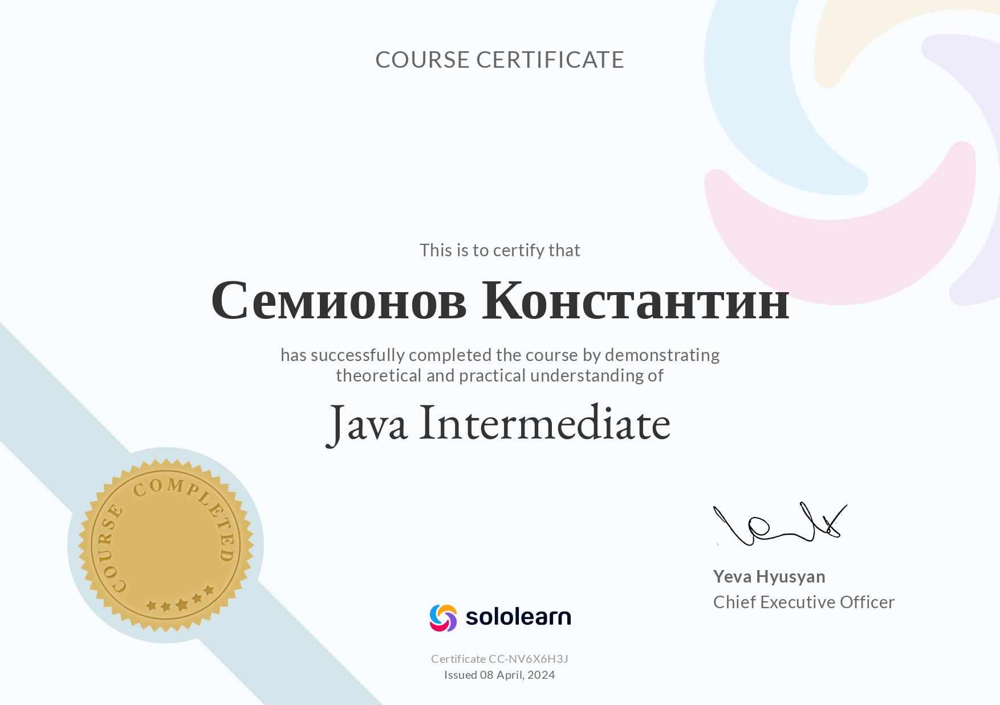
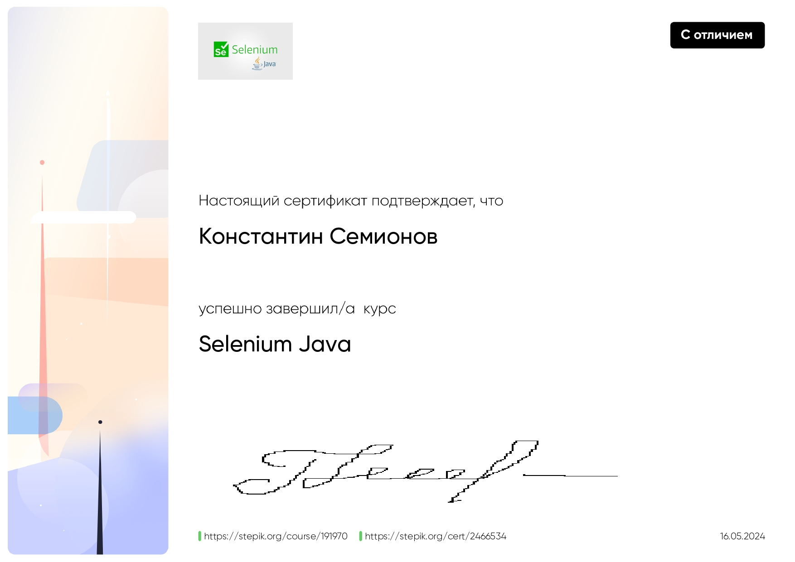
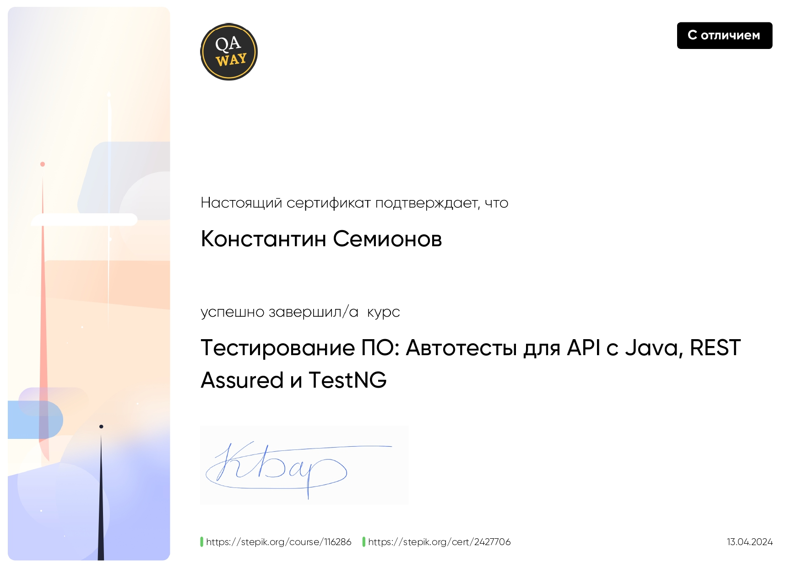
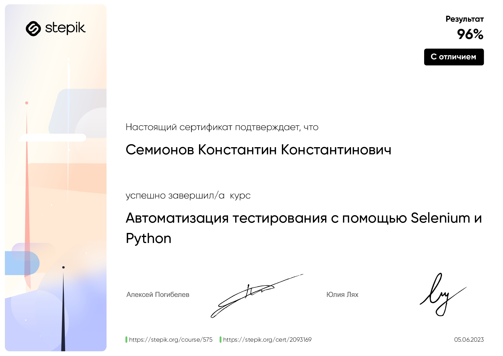
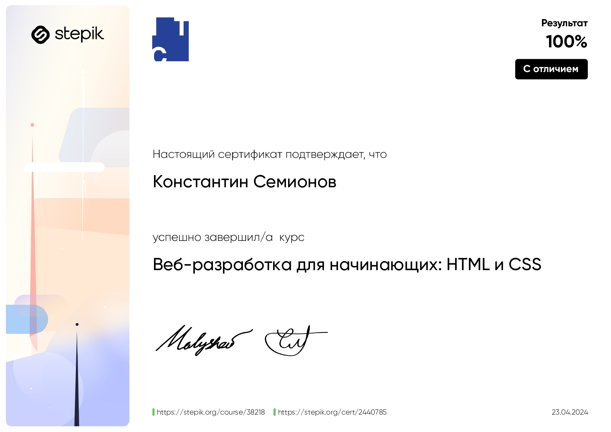

# Привет, я Константин! 👋

---

## Содержание:
- [🚀 Что я умею](#what-i-can-do)
- [📚 Мои проекты](#my-projects)
- [🎯 Мои достижения](#my-achievements)
- [🎨 Вне работы](#outside-of-work)
- [🏅 Сертификаты](#certificates)

---

Я ***QA Automation Engineer*** с опытом работы более 3 лет. Увлекаюсь автоматизацией тестирования и всегда стремлюсь улучшить
качество продуктов, с которыми работаю.

---

  <b> 🌐 Связаться со мной:</b>  

    
    

  <b>Языки программирования:</b>  

  

## 🚀 Что я умею:

- Автоматизация тестирования UI и API с использованием **Selenium**, **Rest Assured**, **JUnit** и **Cucumber**.
- Опыт работы с CI/CD пайплайнами через **Jenkins** и **GitLab** для автоматизации процессов тестирования.
- Настройка и поддержка отчетности в **Allure** для удобного анализа результатов тестов.
- Работал с базами данных, например **PostgreSQL**, для тестирования на уровне данных.
- Контейнеризация приложений с использованием **Docker** и **Kubernetes** для создания гибкой и масштабируемой среды.
- Создание тестов для **Web** и **Mobile** приложений с использованием различных инструментов.

## 📚 Мои проекты:

1. **Java + Rest Assured + Maven**  
   [Java Rest Assured Project](https://github.com/jackripper2703/Java-Rest-Assured)

2. **Python + Selenium**  
   [Selenium Test Project on Python](https://github.com/jackripper2703/Selenium_test_project)

3. **Java + Selenium Grid + Allure**  
   [Selenium with Grid and Allure](https://github.com/jackripper2703/SimbirSoft)

4. **Kotlin**  
   [Kotlin Telegram Bot](https://github.com/Sad-Jack/PartyPlanner)

## 🎯 Мои достижения:

- Писал автоматизированные тесты для **UI** и **API** с использованием **Cucumber**, начиная проект с нуля.
- Проводил **внутренние приемки** в сложной **финтех** компании, тестируя важные бизнес-логики и интеграции.
- Выполнил **регрессионное тестирование** в одиночку, что ускорило процесс релиза и улучшило стабильность продукта.

## 🎨 Вне работы:
- Я увлекаюсь чтением книг по личностному росту и технологиям.
- Люблю решать алгоритмические задачи на **Codewars** и делиться опытом с коллегами.
- Активно участвую в айти митапах, где всегда можно узнать что-то новое и поделиться идеями.
- В свободное время наслаждаюсь настольными играми.

---

Я всегда открыт для новых проектов, интересных задач и команды, с которой можно расти вместе! Если ты ищешь кого-то, кто
готов погружаться в сложные процессы тестирования и предлагать решения — я здесь.

---

## 🏅 Сертификаты:

   

   

   

   

   

   

   

